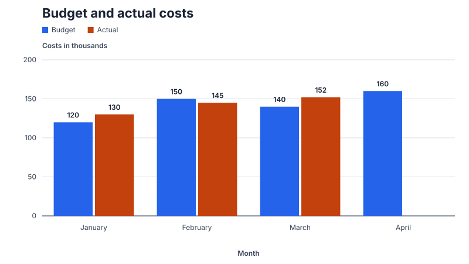

# chartlet

chartlet compiles a small JSON chart specification into a finished, accessible chart at build
time. You get plain SVG, or an HTML figure with caption, source and data table. Nothing runs in
the browser: no chart JavaScript, no hydration, no layout shift.



- **Accessible by default:** every chart carries a title and a generated description of the
  data, and the HTML output always includes the complete data as a table.
- **Deterministic:** the same specification produces the same bytes, so charts can be reviewed,
  diffed and cached like any other build artifact.
- **Honest about problems:** invalid input is rejected with a code, a path and a fix; layout
  compromises such as shortened labels are reported as warnings instead of happening silently.

> **Status:** early alpha. Bar charts (single and grouped, vertical and horizontal) and
> categorical line charts are supported. The specification may still change before the first
> stable release.

## Quick start

chartlet is not published yet. Build the CLI from this repository (Rust 1.88 or newer):

```sh
cargo install --path .
chartlet render examples/monthly-revenue.json --format html -o chart.html
```

A minimal specification:

```json
{
  "schemaVersion": 1,
  "type": "bar",
  "title": "Monthly revenue",
  "data": [
    { "label": "January", "value": 120 },
    { "label": "February", "value": 180 },
    { "label": "March", "value": 150 }
  ]
}
```

## Chart types

| Chart | Specification | Example |
|---|---|---|
| Bar, vertical | `"type": "bar"` with `data` | [monthly-revenue](examples/monthly-revenue.json) |
| Bar, horizontal, with negative values | `"orientation": "horizontal"` | [quarterly-change](examples/quarterly-change.json) |
| Grouped bar, up to four series | `categories` and `series` instead of `data` | [budget-vs-actual](examples/budget-vs-actual.json) |
| Line with gaps for missing values | `"type": "line"`, `null` values | [monthly-trend](examples/monthly-trend.json) |

Each example has its rendered `.svg` and `.html` next to it. The SVG files are also the
reference output of the test suite.

### Missing values

In a line chart, `null` marks an observation that does not exist. chartlet leaves a visible gap
instead of drawing a line across it. In a grouped bar chart, `null` leaves out that bar. The data
table shows these cells as “Missing”. A single-series bar chart requires a value for every
category.

### Several series

Replace `data` with `categories` and `series`. Every series needs exactly one value per category.
A legend is added automatically, and the data table gets one column per series.

```json
{
  "schemaVersion": 1,
  "type": "bar",
  "title": "Budget and actual costs",
  "categories": ["January", "February", "March"],
  "series": [
    { "name": "Budget", "values": [120, 150, 140] },
    { "name": "Actual", "values": [130, 145, null] }
  ]
}
```

## Specification

[`schema/chartlet.schema.json`](schema/chartlet.schema.json) is the complete contract and can be
used for editor validation.

| Field | Required | Description |
|---|---|---|
| `schemaVersion` | yes | Always `1`. |
| `type` | yes | `bar` or `line`. |
| `title` | yes | Visible title; also the accessible name of the chart. |
| `data` | one of | Single series: `[{ "label": "…", "value": 1 }]`. |
| `categories` + `series` | one of | Several series: unique category labels, and `[{ "name": "…", "values": […] }]`. |
| `orientation` | no | `vertical` (default) or `horizontal`; bar charts only. |
| `description` | no | Replaces the generated description. |
| `source` | no | Shown below the chart in the HTML output. |
| `categoryAxis.title` | no | Title of the category axis. |
| `valueAxis.title` | no | Title of the value axis. |
| `valueAxis.format` | no | `number` (default) or `percent`; `0.12` is shown as `12%`. |
| `width`, `height` | no | Size in pixels: 320–2400 × 240–1600, default 800 × 450. |
| `showValues` | no | Value labels on bars and points, default `true`. |

Limits: up to 100 categories and four series. Labels must be unique. Values must be zero or have
a magnitude between `1e-100` and `1e100`.

## Output

| Option | Effect |
|---|---|
| `--format svg` | Standalone SVG with `<title>` and `<desc>` (default). |
| `--format html` | `<figure>` with caption, SVG, source and data table. |
| `--table details` | Puts the HTML data table in a native, initially closed `<details>` (default). |
| `--table visible` | Shows the data table permanently. |
| `--id-prefix <prefix>` | Stable prefix for the accessibility IDs; needed when the same chart appears twice on one page. |
| `-o <path>` | Writes to a file instead of standard output. |
| `--strict` | Fails on any warning. Useful in CI. |

Pass `-` instead of a file name to read the specification from standard input.

The SVG scales with its container, uses CSS classes for all styling and embeds no fonts, scripts
or external resources.

## Accessibility

- The SVG is exposed as a single image (`role="img"`). Its accessible name is the title, and its
  description is generated from the data, for example: “Bar chart with 4 categories and 2 series
  (Budget, Actual). Highest: 160 (Budget in April). Lowest: 120 (Budget in January). 1 value is
  missing.”
- The HTML output adds a `<figure>` with caption and a real `<table>` containing every value,
  including values whose visual label had to be left out.
- Series colors stay distinguishable for the common forms of color-vision deficiency and have at
  least 4.5:1 contrast against white. The legend lists series in the same order as the bars.
- Text is never removed silently: shortened labels and omitted value labels produce warnings, and
  the full text stays in the specification and the data table.

Testing with VoiceOver and NVDA is still pending. Until then, treat the output as designed for
accessibility, not as verified.

## Warnings and errors

Errors stop rendering and name a code, the location in the specification and a way to fix it:

```text
chartlet: series_length_mismatch at /series/0/values: expected 2 values, one per category; use null for a missing value
```

Warnings are written to standard error, and the chart is still produced:

| Code | Meaning |
|---|---|
| `text_truncated` | A label or title was shortened to fit. |
| `value_labels_omitted` | Some value labels had no room next to their bars. |
| `dense_chart` | More than 16 categories; the chart may be hard to read at this size. |

## Astro

The npm package [`@casoon/chartlet`](packages/chartlet/README.md) renders charts while Astro
builds the site and ships no JavaScript to the browser:

```astro
---
import Chart from '@casoon/chartlet/astro';
import revenue from '../data/monthly-revenue.json';
---

<Chart id="monthly-revenue" spec={revenue} />
```

In the alpha, the component calls the `chartlet` CLI, which must be on `PATH` or set via
`CHARTLET_BIN`.

## Rust

```rust
use chartlet::{render_json, RenderFormat, RenderOptions};

let spec = std::fs::read_to_string("examples/monthly-revenue.json")?;
let output = render_json(&spec, RenderFormat::Html, &RenderOptions::default())?;
for warning in &output.warnings {
    eprintln!("{} at {}: {}", warning.code, warning.path, warning.message);
}
std::fs::write("chart.html", output.content)?;
```

`render_with_metrics` accepts your own `TextMetrics` implementation if your pages use a font whose
widths differ noticeably from the built-in profile.

## When chartlet is not the right tool

- You need interaction such as tooltips, zooming, filtering or live updates.
- The data changes at runtime rather than at build time.
- You need maps, networks, 3D charts or chart types beyond the ones listed above.
- You want to explore data rather than publish a finished chart.

## License

[MIT](LICENSE)
